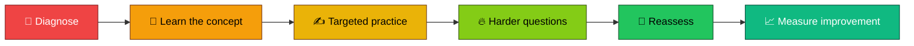
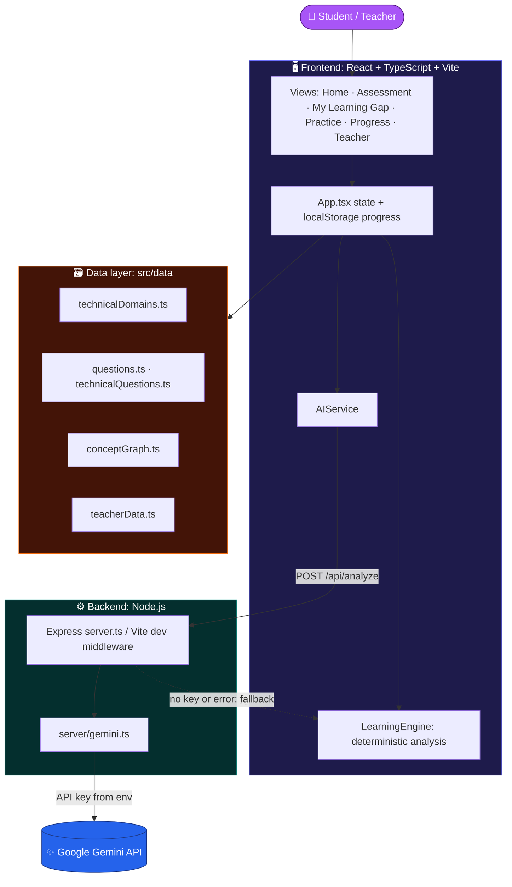

<div align="center">

# 🧠 DOMAINBREAKERS

## 🔍 Your Score Shows **WHAT**. We Discover **WHY**. 🔍

*🟣 A wrong answer is an observation. 🟢 A learning gap is a pattern.*

<br/>

**DomainBreakers** is an AI-assisted learning gap detector for technical education.
It groups a student's responses by concept, finds repeated error patterns, and explains the evidence behind each diagnosis.
It then recommends targeted practice and measures improvement afterwards.

<br/>

`⚛️ React 19` &nbsp; `🔷 TypeScript` &nbsp; `⚡ Vite` &nbsp; `🎨 Tailwind CSS 4` &nbsp; `🟢 Node.js + Express` &nbsp; `✨ Google Gemini` &nbsp; `📊 Recharts`

<br/>

[📂 **GitHub Repository**](https://github.com/sadhanakoravi022/DomainBreakers) &nbsp;•&nbsp; [🚀 **Open in AI Studio**](https://ai.studio/apps/f0e93d0b-9d3f-44f5-91a9-ce41fd398ca2)

</div>

> [!NOTE]
> 🏁 **Hackathon project (DU-01: AI-Powered Learning Gap Detector).** This is a working MVP/prototype built in a short hackathon window, not a production system. Diagnoses are decision support, not ground truth, and teacher-dashboard data is sample data.

---

## 💡 Why DomainBreakers?

Marks tell a student **how much** they got wrong. They don't tell the student **why**.

Two students can both score 4/10 on the same test, for completely different reasons:

- 🔴 **Student A** misunderstands how Python passes mutable objects to functions.
- 🟡 **Student B** understands the concept and made arithmetic slips.

A scoreboard treats them identically, and so does generic "do more practice" advice. Students need to know **which concept is broken and what pattern shows it**.

## ❗ Problem Statement

Marks-based evaluation hides the cause of a mistake. Students keep repeating the same misconception, and teachers can't see it without reading every answer.

> **🧪 Example:** A student answers three Python questions about default arguments, list copies and function side effects incorrectly. The marks show only *"3 wrong"*. The pattern shows **one** underlying gap: **object references & mutability**. Re-reading all of Python won't fix it, but a focused review and targeted drills will.

## ✅ Our Solution

DomainBreakers diagnoses at the **concept** level instead of the score level.

```mermaid
flowchart LR
    A([📝 Student Response]) --> B[🔎 Error Analysis]
    B --> C[🏷️ Error Type]
    C --> D[🧩 Concept Mapping]
    D --> E[📑 Evidence + Confidence]
    E --> F{{🚨 Learning Gap}}
    F --> G[📚 Personalized Learning]
    G --> H[🎯 Targeted Practice]
    H --> I[🔁 Reassessment]
    I --> J([📈 Improvement])

    style A fill:#6366f1,stroke:#312e81,color:#fff
    style B fill:#8b5cf6,stroke:#4c1d95,color:#fff
    style C fill:#a855f7,stroke:#581c87,color:#fff
    style D fill:#06b6d4,stroke:#155e75,color:#fff
    style E fill:#0ea5e9,stroke:#075985,color:#fff
    style F fill:#ef4444,stroke:#7f1d1d,color:#fff
    style G fill:#f59e0b,stroke:#78350f,color:#000
    style H fill:#84cc16,stroke:#365314,color:#000
    style I fill:#22c55e,stroke:#14532d,color:#000
    style J fill:#10b981,stroke:#064e3b,color:#fff
```



---

## ⚙️ How It Works

| Step | | What happens |
|:---:|:---:|---|
| **1** | 📝 **Assessment** | The student picks a technical domain and answers its question set (MCQ and short-answer). |
| **2** | 🗂️ **Response capture** | Each answer is recorded with its correctness. For wrong MCQ options, the misconception that option represents is recorded too. |
| **3** | 🔎 **Error analysis** | Responses are grouped by **concept**, and accuracy is broken down by difficulty (Beginner / Medium / Hard). |
| **4** | 🧬 **Pattern detection** | The engine looks for repeated mistakes and misconception fingerprints within a concept. |
| **5** | 🚨 **Diagnosis** | Each weak concept gets a severity (LOW / MEDIUM / HIGH), a confidence score, a diagnosis type and a "why detected" evidence list. |
| **6** | ✨ **AI explanation** | The server asks Gemini for a conceptual diagnosis, the likely cognitive trap and recommended actions. If Gemini is unavailable, the deterministic engine's result is used. |
| **7** | 🎯 **Practice** | Targeted practice questions are generated for the detected gap. |
| **8** | 📈 **Reassessment** | Scores before and after practice are compared to show improvement. |

---

## 🔍 What Makes It Different

| 🔴 Traditional assessment | 🟢 DomainBreakers |
|---|---|
| Marks | Concept-level diagnosis |
| Right / wrong | Error type and misconception |
| Topic-level weakness ("weak in Python") | Concept-level gap ("object references & mutability") |
| No reasoning shown | Evidence-based "why detected" list |
| One generic score | Severity and confidence indicators |
| Same practice for everyone | Practice targeted at the detected gap |
| One-time test | Diagnose → Practice → Reassess |

---

## ✨ Key Features

### 🟣 Diagnosis
- 🧩 Concept-level gap detection from graded responses
- 📊 Per-concept accuracy by difficulty level
- 🏷️ Misconception mapping on wrong options (`misconceptionMap`)
- 🚦 Severity (LOW / MEDIUM / HIGH) and a confidence score with a breakdown (sample size, error consistency, difficulty gradient, misconception factor)
- 🩺 Diagnosis types such as *Conceptual misunderstanding*, *Application difficulty*, *Calculation error*, *Formula misuse*, *Repeated mistake pattern* and *Insufficient evidence*

### 🔵 AI layer
- 🤖 Server-side Gemini call (`server/gemini.ts`) returns a conceptual diagnosis, pedagogical advice and the cognitive trap identified
- 🛟 Deterministic fallback engine if no API key is set or the call fails, so the app still works

### 🟢 Learning loop
- 🎯 Targeted practice generation for the detected concept
- 📈 Before/after reassessment comparison and a progress view
- 💾 Per-domain progress saved in the browser (`localStorage`)

### 🟠 Teacher view
- 👩‍🏫 Class-level concept gap view with affected-student counts, common error patterns and suggested interventions *(sample cohort data in this MVP)*

### 🌐 Languages
- 🇬🇧 English · 🇮🇳 Hindi · 🇮🇳 Marathi, with technical terms kept recognizable

---

## 🏗️ Domains

The domain list is data-driven (`src/data/technicalDomains.ts`), so adding a domain means adding a config entry and a question set.

| Group | Domains in the repository |
|---|---|
| 🐍 **Programming** | Python, Python Core & Mutability, Java, C, C++, JavaScript, JavaScript & Async Engine, Data Structures & Algorithms |
| 🌐 **Web Development** | HTML & CSS, React, Node.js, Backend Development, APIs & Web Services |
| 🗄️ **Database** | SQL, DBMS, MongoDB |
| 🤖 **AI & Data** | Artificial Intelligence, Machine Learning, Data Science, Data Analytics |
| 🖥️ **Computer Science** | OOP, Operating Systems, Computer Networks, Computer Architecture |
| 📐 **Mathematics** | Engineering Mathematics (algebra), Probability & Statistics, Linear Algebra |

> [!IMPORTANT]
> Question-bank depth varies across domains. The domains with the most detailed concept and misconception mapping are the ones the demo is built around (Python Core & Mutability, JavaScript & Async, Engineering Mathematics). Other domains use shorter seed-based question sets. Mechanical, Electrical and other non-computing engineering departments are **future scope**, not part of the current build.

## 🎚️ Test Levels

The five-level model below is the intended design. In the **current MVP**, questions carry a difficulty tag (Beginner / Medium / Hard), and the diagnosis uses it to compare basic vs applied performance. Separate selectable levels and fully adaptive question selection are on the roadmap.

| Level | Purpose | Status |
|---|---|:---:|
| 🟢 **01 · Foundation** | Definitions, formulas, simple calculations | 🛣️ Roadmap |
| 🔵 **02 · Core** | Standard concepts and formula application | 🛣️ Roadmap |
| 🟡 **03 · Application** | Multi-step and scenario problems | 🛣️ Roadmap |
| 🟠 **04 · Advanced** | Complex reasoning and troubleshooting | 🛣️ Roadmap |
| 🟣 **05 · Diagnostic AI** | Questions chosen from previous answers to confirm or reject a suspected gap | 🛣️ Roadmap |

---

## 📋 Example Learning Gap Report

> [!NOTE]
> This is an **illustrative example** of the report's shape, not output captured from a real student.

| Field | Value |
|---|---|
| 🌐 **Domain** | Python Core & Mutability |
| 🧩 **Concept** | Object References & Mutability |
| 🕳️ **Gap** | Mutable default argument sharing |
| 🔴 **Severity** | HIGH |
| 🎯 **Confidence** | 92% |
| 📑 **Evidence** | 3 related responses |

**🔎 Why detected**
- Missed the default-argument question at Beginner and Medium level
- Chose the "fresh list on every call" option each time (same misconception)
- Basic syntax questions in the same domain were answered correctly

**✅ Recommended actions**
1. Review how default arguments are evaluated once, at definition time
2. Trace object identity across calls
3. Solve targeted practice questions on this concept
4. Reassess

## 🛤️ Personalized Learning Path



In the app, the path is modeled as ordered steps: concept review → drill → application practice → reassessment.

---

## 🏛️ System Architecture



**Design notes**
- 🧮 The deterministic `LearningEngine` always produces a diagnosis; Gemini adds the conceptual explanation on top.
- 🔐 The API key is read **server-side only** and is never shipped to the browser.
- 📦 Data lives in typed TypeScript modules, so the MVP needs no database.

## 🧰 Tech Stack

| Layer | Technology |
|---|---|
| 🖥️ **Frontend** | ⚛️ React 19 · 🔷 TypeScript · ⚡ Vite · 🎨 Tailwind CSS 4 |
| 🎛️ **UI** | Lucide React · Recharts · canvas-confetti |
| ⚙️ **Backend** | 🟢 Node.js · Express · `tsx` · `dotenv` |
| 🤖 **AI** | ✨ Google Gemini via `@google/genai` |
| 💾 **Persistence** | Browser `localStorage` (MVP) |

## 📁 Project Structure

```text
DomainBreakers/
├── server.ts                 # Express server: /api/analyze, /api/generate-practice, serves dist/
├── server/
│   └── gemini.ts             # Gemini diagnosis prompt + call
├── src/
│   ├── App.tsx               # App state, tab navigation, saved progress
│   ├── main.tsx
│   ├── components/           # Navbar, AssessmentView, StudentFlowViews, reports, teacher view, ...
│   ├── data/                 # technicalDomains, questions, technicalQuestions, conceptGraph, teacherData
│   ├── services/
│   │   ├── learningEngine.ts # Concept grouping, severity, confidence, evidence, practice generation
│   │   └── aiService.ts      # Calls the backend API
│   └── types/index.ts        # Question, Diagnosis, Result and Language types
├── vite.config.ts            # Vite config + dev-time API middleware
├── .env.example
└── package.json
```

---

## 🚀 Installation & Setup

**Prerequisites:** Node.js and npm

```bash
git clone https://github.com/sadhanakoravi022/DomainBreakers.git
cd DomainBreakers
npm install
cp .env.example .env.local     # then add your Gemini API key
npm run dev
```

🌍 The dev server runs at **http://localhost:3000**.

| Command | What it does |
|---|---|
| `npm run dev` | 🟢 Start the Vite dev server on port 3000 |
| `npm run build` | 🏗️ Build the frontend into `dist/` |
| `npm start` | 🚀 Run `server.ts` with `tsx` (serves `dist/` and the API) |
| `npm run lint` | 🧹 Type-check with `tsc --noEmit` |

## 🔐 Environment Variables

Copy `.env.example` and fill in your values:

| Variable | Purpose |
|---|---|
| `GEMINI_API_KEY` | Enables the Gemini-powered diagnosis. If missing, the app uses the deterministic engine. |
| `APP_URL` | URL where the app is hosted (set by AI Studio at runtime, optional locally). |

> [!WARNING]
> 🚫 **Never commit API keys.** `.gitignore` already excludes `.env*` files except `.env.example`. Keep real keys in `.env.local` or your hosting platform's secrets.

---

## 🎬 Demo Flow

```mermaid
flowchart LR
    A[🏠 Home] --> B[🌐 Select Domain]
    B --> C[📝 Assessment]
    C --> D[🤖 AI Analysis]
    D --> E[🚨 My Learning Gap]
    E --> F[🎯 Practice]
    F --> G[📈 Progress]
    G --> H[👩‍🏫 Teacher View]

    style A fill:#6366f1,color:#fff,stroke:#312e81
    style B fill:#8b5cf6,color:#fff,stroke:#4c1d95
    style C fill:#06b6d4,color:#fff,stroke:#155e75
    style D fill:#0ea5e9,color:#fff,stroke:#075985
    style E fill:#ef4444,color:#fff,stroke:#7f1d1d
    style F fill:#f59e0b,color:#000,stroke:#78350f
    style G fill:#22c55e,color:#000,stroke:#14532d
    style H fill:#a855f7,color:#fff,stroke:#581c87
```



1. 🏠 **Home:** pick a technical domain from the domain switcher (e.g. *Python Core & Mutability*).
2. 📝 **Assessment:** answer the questions.
3. 🤖 **AI analysis:** the loading screen runs the deterministic engine and the Gemini call.
4. 🚨 **My Learning Gap:** see the top gap with severity, confidence and the "why detected" evidence.
5. 🎯 **Practice:** solve targeted questions for that concept.
6. 📈 **Progress:** compare before and after.
7. 👩‍🏫 **Teacher:** view the class-level concept gap summary.

🌐 The language selector switches between English, Hindi and Marathi.

## 🏆 Hackathon Value

| | |
|---|---|
| 🔍 **Explainable** | Every diagnosis lists the evidence behind it instead of giving a bare label. |
| 🎯 **Personalized** | Practice follows the detected concept, not a fixed worksheet. |
| ⚖️ **Honest about uncertainty** | Confidence and an *insufficient evidence* state avoid overclaiming from one or two answers. |
| 🛟 **Resilient** | The deterministic fallback keeps the product working without the AI. |
| 🧱 **Extensible** | Domains, questions and misconceptions are data, so new departments can be added without rewriting the UI. |
| 👩‍🏫 **Teacher-facing** | The class view surfaces shared misconceptions for intervention. |

## 🔭 Future Scope

- 🎚️ Selectable Foundation → Diagnostic AI test levels and fully adaptive question selection
- 🏭 More engineering departments (Mechanical, Electrical, E&TC, Civil, ...)
- 🕸️ Interactive concept dependency graph with cross-subject prerequisites (data model and components are in the repo, not yet wired into the main flow)
- 📚 Deeper, hand-authored misconception banks for every domain
- 📊 Real teacher analytics from stored student data (replacing sample data) and a database backend
- 📅 Long-term progress tracking and LMS integration
- 🧪 Evaluation of diagnosis quality against teacher-labelled data

## 📸 Screenshots

> 🖼️ _Screenshots coming soon._

## 👥 Team

**Team DomainBreakers**

| Name | Role |
|---|---|
| _Add team member_ | _Role_ |

## 🤝 Contributing

Contributions are welcome.

1. 🍴 Fork the repository
2. 🌿 Create a branch: `git checkout -b feature/your-feature`
3. 💾 Commit your changes and open a pull request

To add a domain, add an entry in `src/data/technicalDomains.ts` (and its `DomainId` in `src/types/index.ts`) plus a question set with concept and misconception tags.

## 📄 License

No license file is currently included in the repository. A license can be added later.

---

<div align="center">

## 💜 Don't just measure the score. Understand the gap. 💚

</div>